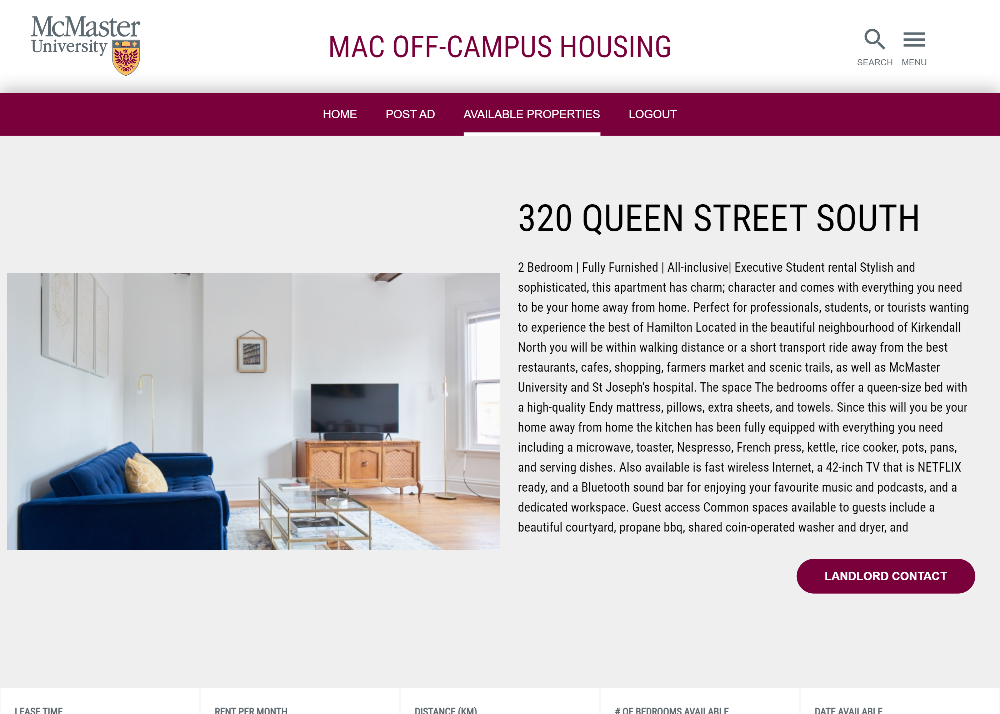
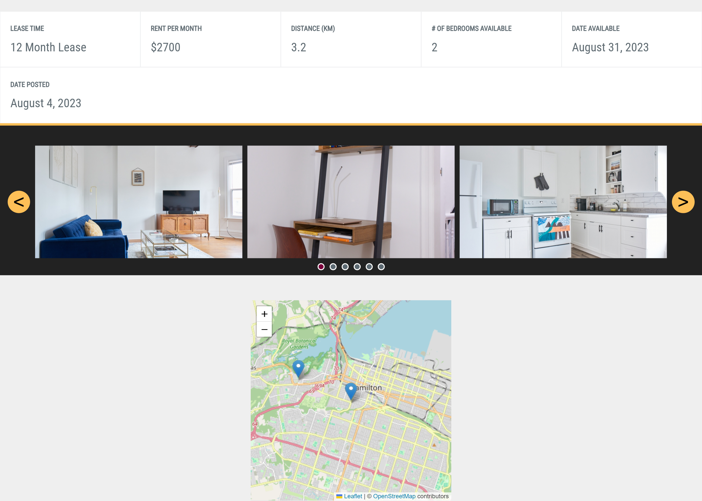
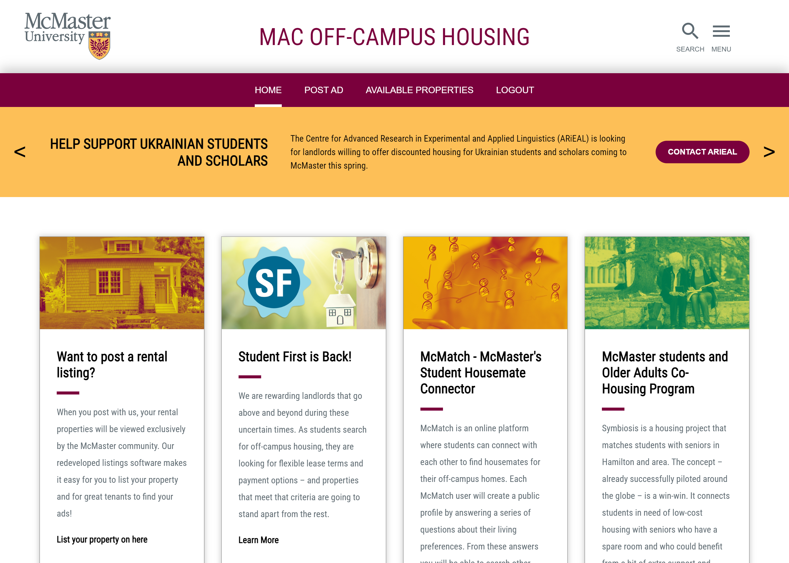
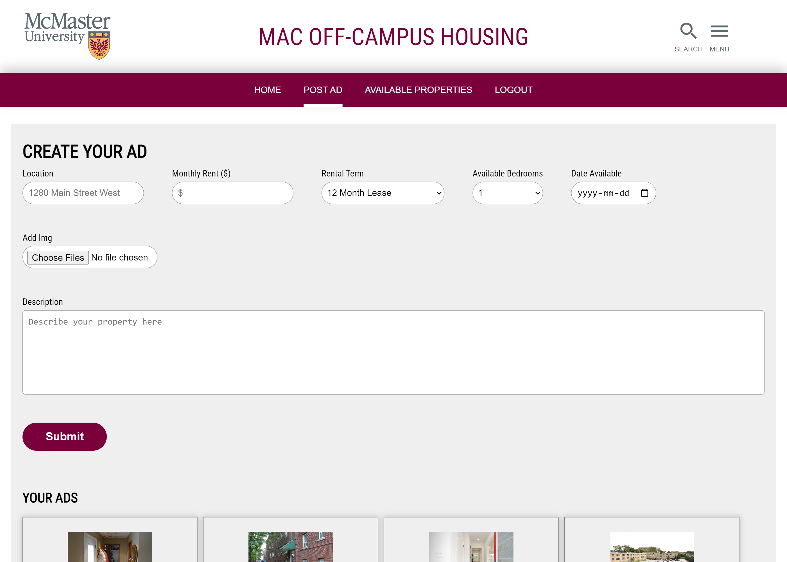

# McMaster Housing Clone (frontend) 🏠

Clone of McMaster's offcampus housing site. Allows users to create new property listings and search pre-existing ones.

## Deployment 🚀

https://mcmaster-housing-clone.vercel.app/

## Features

- Login using user's Google account
- Able to create advertisements with information about a property
- Listed properties can be sorted and filtered
- Each property page displays information and a map of where the property is located

## Related

- [McMaster Housing Clone Backend](https://github.com/ClearlyyConfused/mcmaster-housing-clone-api)
- [Official McMaster Off-Campus Housing Site](https://offcampus.mcmaster.ca/)

## Screenshots 📸

